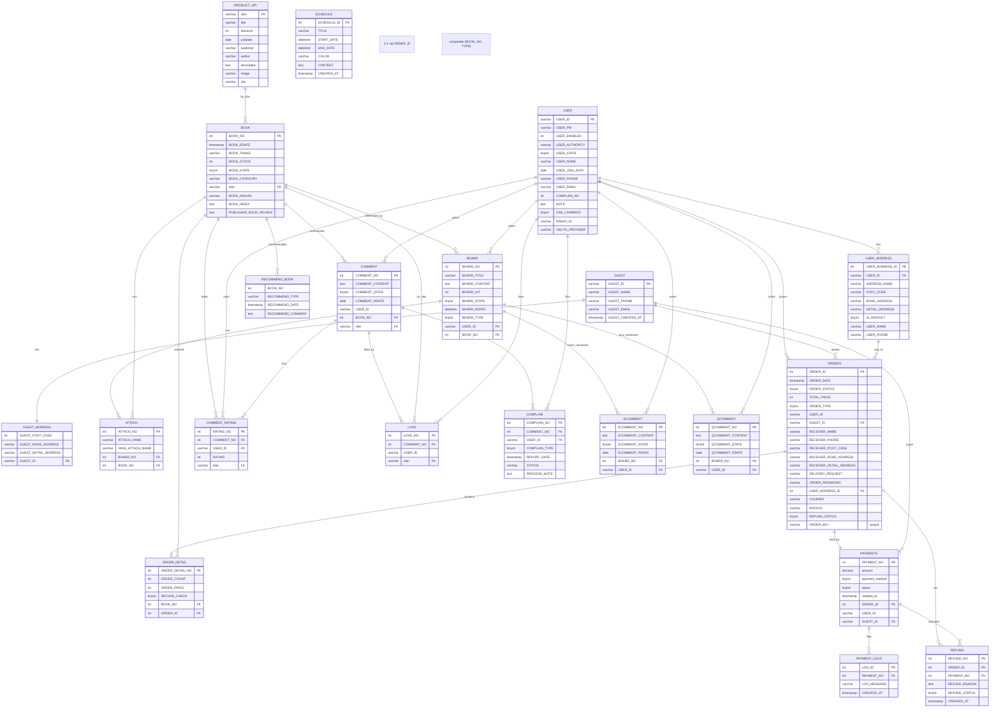

# bookHiatus

## 📑 목차

- [프로젝트 진행기간](#프로젝트-진행기간)
- [개요](#개요)
- [주요기능](#주요기능)
- [기술 및 컨벤션](#기술-및-컨벤션) 
- [트러블슈팅](#트러블슈팅)
- [개발환경](#개발환경)
- [ERD](#erd)
- [프로젝트 파일 구조](#프로젝트-파일-구조)
- [명세서 API Reference](#명세서-api-reference)
- [서비스화면](#서비스화면)
- [팀원(역할/깃계정)](#팀원역할깃계정)

--- 

## 개요
- 온라인 서점 웹서비스로, 사용자·비회원 주문/결제, 도서 검색·상세·장바구니, 게시판(공지/Q&A/이벤트) 등 커머스 핵심 흐름을 end-to-end로 구현했습니다.
- Spring MVC + MyBatis + MySQL 기반 백엔드와 JSP/jQuery/Bootstrap UI, Spring Security 인증/인가, 외부 연동(Naver Book, Kakao 로그인, KakaoPay·TossPay 결제)을 통합했습니다.
- 비회원은 UUID 기반 주문키로 안전하게 조회하고, 배송 시작 전/후를 기준으로 취소·환불을 분기 처리하여 정합성과 보안을 강화했습니다.
- 관리자 콘솔에서는 도서/추천/재고/주문·환불/신고/매출·일정 관리와 대시보드 차트를 제공해 운영 효율을 높였습니다.
  
--- 
## 주요기능

- 사용자 기능: 도서 목록/상세, 리뷰, 장바구니·주문
- 관리자 기능: 도서/추천/재고/주문·배송/환불/신고/매출/일정/회원 관리
- 대시보드 및 통계 시각화 제공
- [상세](../../wiki/상세)
  
--- 

## ⚙️ 기술 및 컨벤션
### 🧑‍💻 사용자 영역 (User-facing)
- JSP + JSTL(c:), Spring Security 태그(sec:) 기반 뷰 렌더링
- jQuery Ajax 통신으로 비동기 처리 (로그인/회원가입/주문/댓글 등)
- 회원 비밀번호: BCryptPasswordEncoder 단방향 암호화
- ROLE_USER / ROLE_ADMIN 권한 기반 접근 제어

### 🛠 관리자 영역 (Admin)
- Bootstrap 5 관리자 레이아웃 (SB Admin)
- jQuery + simple-datatables (리스트/검색/페이징)
- Chart.js (매출·통계 시각화), FullCalendar (일정 관리)
- Ajax 요청 컨벤션: /admin/도메인/액션 (/admin/books/bookInsert)
- 응답 포맷: {success:true, data:...} 구조 통일

### 🧩 공통 레이아웃
- adminHeader.jsp, adminNav.jsp, adminFooter.jsp로 모듈화
- header.jsp, footer.jsp (사용자 영역 공통 레이아웃)
- err401.jsp, err404.jsp, err500.jsp 에러 페이지 분리

### 🌐 외부 연동
- Naver Book API: 도서 등록 자동화 (관리자 페이지 검색 → 자동 입력)
- KakaoPay / TossPayments API: 결제 승인·취소·환불 처리
- API Key/Secret 값은 환경변수·properties 파일로 분리 관리

### 🎨 UX / UI 컨벤션
- 데이터 검증: 송장번호 영숫자, 배송상태 전이 조건(배송중→완료) 필수 검증
- 금액: toLocaleString("ko-KR") / 날짜: Date.toLocaleString("ko-KR")
- 반응형 CSS (@media) 적용 — PC·Tablet·Mobile 대응
- 공통 스크립트 함수화 (updateCartCount(), normalizeCartItems())
- Mapper XML 네임스페이스 규칙: 도메인Mapper (예: BookMapper, OrderMapper)

### 🏗 아키텍처 & DB 설계
- 계층 구조: Controller → Service → DAO → MyBatis Mapper → DB
- VO 클래스 일관된 네이밍(*VO)
- DB 정규화 및 FK 관계 명확화
- 작성일(BOARD_RDATE) vs 수정일(BOARD_UDATE) 분리 관리
- 비회원 주문: UUID 기반 orderKey 발급 → 이메일 + orderKey 조합 조회

### 🔄 운영 & 유지보수
- contextPath 기반 리소스 참조 (<c:url>, ${pageContext.request.contextPath})
- InventoryScheduler (5분 주기) → 도서 재고 상태 자동 갱신
- 공통 에러 처리: ControllerAdvice or try-catch 기반 JSON 응답 일관성 유지
  
--- 
## 트러블슈팅

# 트러블슈팅 심화 정리
- [비회원 주문키(orderKey) 관리 UX](../../wiki/비회원 주문키(orderKey) 관리 UX).
- [회원,비회원 결제로직 혼재문제](../../wiki/회원,비회원 결제로직 혼재문제)
- [주문취소(Cancel) vs 환불(Refund) 흐름 모호성](../../wiki/주문취소(Cancel) vs 환불(Refund) 흐름 모호성)
  
다음 3가지는 이번 장바구니 페이지의 핵심 안정화 포인트입니다.

- **A. `updateCartCount()`는 한 곳에서만 정의/사용**
- **B. 로그인 시 `동기화 → 서버재조회 → 렌더 → 카운트` 순서 보장**
- **C. `normalizeCartItems`의 죽은 코드 제거**

---

## A) `updateCartCount()`는 한 곳에서만 정의/사용

### 문제 배경
- 페이지/헤더/별도 스크립트에 **중복 정의**되거나, 담기/삭제 시 **제각각 직접 갱신**하면서
  헤더 `#cart-count`와 본문 타이틀(예: `#cartCountTitle`) 숫자가 **엇갈림**.
- 헤더와 본문에 **ID 중복**(`cart-count`)이 있으면 또 어긋남.

### ✅ 해결 원칙
- **하나의 함수**에서 로그인/비로그인 **분기 포함**해 **표시 요소 2곳**(헤더·본문)을 동시에 갱신.
- **호출 지점 표준화**: 초기 진입 / 렌더 직후 / 추가·삭제·수량 변경 직후 / 동기화 완료 직후.
- **ID 중복 금지**: 헤더는 `#cart-count`만, 본문은 `#cartCountTitle`(또는 하나로 통일)만.

### ⛔ Before (흩어진 갱신)
```js
// 1) 어떤 곳은 로컬 길이로
$("#cart-count").text((JSON.parse(localStorage.getItem("cartItems"))||[]).length);

// 2) 어떤 곳은 서버 카운트로
$.get(contextPath + "/product/getCartCount.do", function (count) {
  $("#cart-count").text(parseInt(count,10)||0);
});

// 3) 담기/삭제 핸들러에서 각자 직접 텍스트 변경(호출 누락/중복 발생)

```

### ✅ After (단일 함수 + 표준 호출)
```js
function updateCartCount() {
  const elHeader = document.getElementById("cart-count");     // 헤더
  const elTitle  = document.getElementById("cartCountTitle"); // 본문
  if (!elHeader && !elTitle) return;

  if (typeof isLoggedIn !== "undefined" && isLoggedIn) {
    $.get(contextPath + "/product/getCartCount.do", function(count) {
      const n = parseInt(count, 10) || 0;
      if (elHeader) {
        elHeader.textContent = n;
        elHeader.style.visibility = n > 0 ? "visible" : "hidden";
      }
      if (elTitle) elTitle.textContent = "장바구니(" + n + ")";
    }).fail(function(err){
      console.error("장바구니 개수 불러오기 실패", err);
    });
  } else {
    let items = JSON.parse(localStorage.getItem("cartItems")) || [];
    if (!Array.isArray(items)) items = Object.values(items).filter(o => typeof o === 'object');
    const n = items.length;
    if (elHeader) {
      elHeader.textContent = n;
      elHeader.style.visibility = n > 0 ? "visible" : "hidden";
    }
    if (elTitle) elTitle.textContent = "장바구니(" + n + ")";
  }
}

// 표준 호출 지점
$(document).ready(function(){
  updateCartCount();         // 초기
});
renderCartItems(); updateCartCount(); // 렌더 직후
// 담기/삭제/수량 변경/동기화 완료 직후에도 동일 함수 호출

```
### 체크리스트
- updateCartCount()는 한 곳에서만 정의/사용(공통 스크립트).
- 헤더 #cart-count 1개, 본문 #cartCountTitle 1개(중복/혼용 금지).
- 렌더·삭제·수량 변경·동기화 완료 후마다 updateCartCount() 호출.

## B) 로그인 시 동기화 → 서버재조회 → 렌더 → 카운트 순서 보장
### 문제 배경
- 로그인 직후 로컬→서버 동기화가 끝나기 전에 렌더/카운트를 먼저 실행 → 값이 깜빡이거나 뒤늦게 변경.

### 핵심 해결 원칙
- syncLocalCartToDB()
- fetchAndUpdateCart() (서버 최신 데이터 재조회)
- renderCartItems()
- updateCartCount() / updateCartMessage()

###  ⛔ Before (순서 뒤섞임)
```js
$(document).ready(function () {
  renderCartItems();
  updateCartCount();
  if (isLoggedIn) {
    syncLocalCartToDB();      // 나중에 동기화 → 값이 뒤늦게 바뀜
    fetchAndUpdateCart();
  }
});
```
### ✅ After (체이닝으로 순서 보장)
```js
$(document).ready(function () {
  if (isLoggedIn) {
    $.when(syncLocalCartToDB())                    // 1) 로컬 → 서버 동기화
      .always(function () {
        return $.get(contextPath + "/product/getCartByUser.do"); // 2) 서버 최신 데이터 조회
      })
      .done(function (data) {
        dbCartItems = Array.isArray(data) ? data : [];
        renderCartItems();                         // 3) 렌더
      })
      .always(function () {
        updateCartCount();                         // 4) 카운트/메시지
        updateCartMessage();
      });
  } else {
    renderCartItems();
    updateCartCount();
    updateCartMessage();
  }
});
```

### C) normalizeCartItems 죽은 코드 제거
### 문제 배경
- return 이후에 LocalStorage 재파싱 블록이 남아 있어, 실제로는 절대 실행되지 않는 죽은 코드가 포함.
- 가독성/유지보수성 저하 및 오해 유발.
### Before (조기 return 아래 죽은 코드)
```js
function normalizeCartItems(items) {
    const merged = {};
    items.forEach(item => {
        const key = item.bookNo || item.isbn || item.id;
        const quantity = Number(item.quantity || item.count || 1);

        if (quantity < 1) return; // 0개는 렌더링 안 함

        if (!merged[key]) {
            merged[key] = { ...item, quantity: quantity };
        } else {
            merged[key].quantity += quantity;
        }
    });
    return Object.values(merged);
    
  const raw = localStorage.getItem("cartItems");
  let cartItems = [];
  try {
    const parsed = JSON.parse(raw);
    if (Array.isArray(parsed)) {
      cartItems = parsed;
    } else if (typeof parsed === 'object' && parsed !== null) {
      cartItems = Object.values(parsed).filter(item => typeof item === 'object');
    }
  } catch (e) {
     console.error("localStorage 파싱 오류", e);
  }
  return cartItems;

}
```
### After (합산 로직만 유지)
```js
function normalizeCartItems(items) {
  const merged = {};
  items.forEach(item => {
    const key = item.bookNo || item.isbn || item.id;
    const quantity = Number(item.quantity || item.count || 1);
    if (!key || quantity < 1) return;      // 키 없거나 0 이하는 스킵
    if (!merged[key]) merged[key] = { ...item, quantity };
    else merged[key].quantity += quantity; // 중복 항목 수량 합산
  });
  return Object.values(merged);
}
```
--- 

## 개발환경

- JDK 1.8, MySQL 8.0, TOMCAT 9.0, SPRING FRAMEWORK 4.3.3.RELEASE, SPRING SECURITY 3.2.10.RELEASE, MyBatis 3.4.1
- JAVA8, HTML5, CSS3, JSP4, JavaScript, jQuery, Ajax
- SpringToolSuite 4, Visual Studio Code, ERMaster, MySQL (Workbench 8.0),GitHub, Notion
  
--- 

## ERD




---
## 프로젝트 파일 구조


### BackEnd (Java + Spring)

```text
src/
├─ main/
│ ├─ java/
│ │ ├─ com/
│ │ │ ├─ bookGap/
│ │ │ │ ├─ config/
│ │ │ │ │ ├─ AppConfig.java
│ │ │ │ ├─ controller/
│ │ │ │ │ ├─ AboutController.java
│ │ │ │ │ ├─ AddressController.java
│ │ │ │ │ ├─ AdminBookController.java
│ │ │ │ │ ├─ AdminIndexController.java
│ │ │ │ │ ├─ AdminInventoryManagementController.java
│ │ │ │ │ ├─ AdminOrderController.java
│ │ │ │ │ ├─ AdminRecommendController.java
│ │ │ │ │ ├─ AdminReportManagementController.java
│ │ │ │ │ ├─ AdminSalesController.java
│ │ │ │ │ ├─ AdminScheduleController.java
│ │ │ │ │ ├─ AdminUserInfoController.java
│ │ │ │ │ ├─ BookController.java
│ │ │ │ │ ├─ BoardController.java
│ │ │ │ │ ├─ CartController.java
│ │ │ │ │ ├─ ChoiceController.java
│ │ │ │ │ ├─ CommentController.java
│ │ │ │ │ ├─ CommentLoveController.java
│ │ │ │ │ ├─ CommentRatingController.java
│ │ │ │ │ ├─ ECommentController.java
│ │ │ │ │ ├─ GlobalModelAttribute.java
│ │ │ │ │ ├─ GuestController.java
│ │ │ │ │ ├─ HeaderController.java
│ │ │ │ │ ├─ HomeController.java
│ │ │ │ │ ├─ KakaoLoginController.java
│ │ │ │ │ ├─ MypageController.java
│ │ │ │ │ ├─ OrderController.java
│ │ │ │ │ ├─ PaymentController.java
│ │ │ │ │ ├─ ProductApiController.java
│ │ │ │ │ ├─ QCommentController.java
│ │ │ │ │ ├─ RefundController.java
│ │ │ │ │ ├─ SearchController.java
│ │ │ │ │ ├─ UserController.java
│ │ │ │ │ └─ adminRefundController.java
│ │ │ │ ├─ dao/
│ │ │ │ │ ├─ AddressDAO.java
│ │ │ │ │ ├─ AdminBookDAO.java
│ │ │ │ │ ├─ AdminOrderDAO.java
│ │ │ │ │ ├─ AdminRefundDAO.java
│ │ │ │ │ ├─ AdminSalesDAO.java
│ │ │ │ │ ├─ AdminScheduleDAO.java
│ │ │ │ │ ├─ BookDAO.java
│ │ │ │ │ ├─ BoardDAO.java
│ │ │ │ │ ├─ CartDAO.java
│ │ │ │ │ ├─ CommentDAO.java
│ │ │ │ │ ├─ CommentLoveDAO.java
│ │ │ │ │ ├─ CommentRatingDAO.java
│ │ │ │ │ ├─ ComplainDAO.java
│ │ │ │ │ ├─ ECommentDAO.java
│ │ │ │ │ ├─ GuestDAO.java
│ │ │ │ │ ├─ MypageDAO.java
│ │ │ │ │ ├─ OrderDAO.java
│ │ │ │ │ ├─ PaymentDAO.java
│ │ │ │ │ ├─ ProductApiDAO.java
│ │ │ │ │ ├─ QCommentDAO.java
│ │ │ │ │ ├─ RecommendBookDAO.java
│ │ │ │ │ ├─ RefundDAO.java
│ │ │ │ │ └─ UserDAO.java
│ │ │ │ ├─ filter/
│ │ │ │ │ ├─ LoggingFilter.java
│ │ │ │ ├─ scheduler/
│ │ │ │ │ ├─ InventoryScheduler.java
│ │ │ │ ├─ service/
│ │ │ │ │ ├─ AddressService.java
│ │ │ │ │ ├─ AddressServiceImpl.java
│ │ │ │ │ ├─ AdminBookService.java
│ │ │ │ │ ├─ AdminBookServiceImpl.java
│ │ │ │ │ ├─ AdminOrderInfoService.java
│ │ │ │ │ ├─ AdminOrderInfoServiceImpl.java
│ │ │ │ │ ├─ AdminRefundService.java
│ │ │ │ │ ├─ AdminRefundServiceImpl.java
│ │ │ │ │ ├─ AdminSalesService.java
│ │ │ │ │ ├─ AdminSalesServiceImpl.java
│ │ │ │ │ ├─ AdminScheduleService.java
│ │ │ │ │ ├─ AdminScheduleServiceImpl.java
│ │ │ │ │ ├─ AdminUserInfoService.java
│ │ │ │ │ ├─ AdminUserInfoServiceImpl.java
│ │ │ │ │ ├─ BoardService.java
│ │ │ │ │ ├─ BoardServiceImpl.java
│ │ │ │ │ ├─ BookService.java
│ │ │ │ │ ├─ BookServiceImpl.java
│ │ │ │ │ ├─ CartService.java
│ │ │ │ │ ├─ CartServiceImpl.java
│ │ │ │ │ ├─ CommentLoveService.java
│ │ │ │ │ ├─ CommentLoveServiceImpl.java
│ │ │ │ │ ├─ CommentRatingService.java
│ │ │ │ │ ├─ CommentRatingServiceImpl.java
│ │ │ │ │ ├─ CommentService.java
│ │ │ │ │ ├─ CommentServiceImpl.java
│ │ │ │ │ ├─ ComplainService.java
│ │ │ │ │ ├─ ComplainServiceImpl.java
│ │ │ │ │ ├─ ECommentService.java
│ │ │ │ │ ├─ ECommentServiceImpl.java
│ │ │ │ │ ├─ GuestService.java
│ │ │ │ │ ├─ GuestServiceImpl.java
│ │ │ │ │ ├─ KakaoUserDetails.java
│ │ │ │ │ ├─ MypageService.java
│ │ │ │ │ ├─ MypageServiceImpl.java
│ │ │ │ │ ├─ OrderService.java
│ │ │ │ │ ├─ OrderServiceImpl.java
│ │ │ │ │ ├─ PaymentService.java
│ │ │ │ │ ├─ PaymentServiceImpl.java
│ │ │ │ │ ├─ ProductApiService.java
│ │ │ │ │ ├─ ProductApiServiceImpl.java
│ │ │ │ │ ├─ QCommentService.java
│ │ │ │ │ ├─ QCommentServiceImpl.java
│ │ │ │ │ ├─ RecommendBookService.java
│ │ │ │ │ ├─ RecommendBookServiceImpl.java
│ │ │ │ │ ├─ RefundService.java
│ │ │ │ │ ├─ RefundServiceImpl.java
│ │ │ │ │ ├─ UserAuthenticationService.java
│ │ │ │ │ ├─ UserDeniedHandler.java
│ │ │ │ │ ├─ UserLoginFailureHandler.java
│ │ │ │ │ ├─ UserLoginSuccessHandler.java
│ │ │ │ │ ├─ UserService.java
│ │ │ │ │ └─ UserServiceImpl.java
│ │ │ │ ├─ util/
│ │ │ │ │ ├─ PagingUtil.java
│ │ │ │ │ └─ StringUtils.java
│ │ │ │ └─ vo/
│ │ │ │ ├─ AdminOrderUpdateRequestVO.java
│ │ │ │ ├─ BoardVO.java
│ │ │ │ ├─ BookVO.java
│ │ │ │ ├─ CartVO.java
│ │ │ │ ├─ CommentLoveVO.java
│ │ │ │ ├─ CommentRatingVO.java
│ │ │ │ ├─ CommentVO.java
│ │ │ │ ├─ ComplainSummaryVO.java
│ │ │ │ ├─ ComplainVO.java
│ │ │ │ ├─ ECommentVO.java
│ │ │ │ ├─ GuestVO.java
│ │ │ │ ├─ KakaoPayCancelVO.java
│ │ │ │ ├─ KakaoPayRequestVO.java
│ │ │ │ ├─ MypageVO.java
│ │ │ │ ├─ NaverBookResponse.java
│ │ │ │ ├─ OrderDetailVO.java
│ │ │ │ ├─ OrderItemVO.java
│ │ │ │ ├─ OrderVO.java
│ │ │ │ ├─ PaymentVO.java
│ │ │ │ ├─ ProductApiVO.java
│ │ │ │ ├─ QCommentVO.java
│ │ │ │ ├─ RecommendBookVO.java
│ │ │ │ ├─ RefundUpdateRequestVO.java
│ │ │ │ ├─ RefundVO.java
│ │ │ │ ├─ SalesVO.java
│ │ │ │ ├─ ScheduleVO.java
│ │ │ │ ├─ SearchVO.java
│ │ │ │ ├─ TossCancelVO.java
│ │ │ │ ├─ TossRequestVO.java
│ │ │ │ ├─ UserAddressVO.java
│ │ │ │ ├─ UserInfoVO.java
│ │ │ │ ├─ UserVO.java
│ │ │ │ └─ ComplainVO.java
├─ test/
│ └─ java/
```

### FrontEnd (JSP + Static Resources)

```text
src/
├─ main/
│ ├─ webapp/
│ │ ├─ WEB-INF/
│ │ │ ├─ views/
│ │ │ │ ├─ about.jsp
│ │ │ │ ├─ admin/
│ │ │ │ │ ├─ adminBook.jsp
│ │ │ │ │ ├─ adminGuestOrderInfo.jsp
│ │ │ │ │ ├─ adminIndex.jsp
│ │ │ │ │ ├─ adminInventoryManagement.jsp
│ │ │ │ │ ├─ adminRefund.jsp
│ │ │ │ │ ├─ adminReportManagement.jsp
│ │ │ │ │ ├─ adminSales.jsp
│ │ │ │ │ ├─ adminSchedule.jsp
│ │ │ │ │ ├─ adminUserInfo.jsp
│ │ │ │ │ ├─ adminUserOrderInfo.jsp
│ │ │ │ │ ├─ err401.jsp
│ │ │ │ │ ├─ err404.jsp
│ │ │ │ │ └─ err500.jsp
│ │ │ │ ├─ board/
│ │ │ │ │ ├─ eventList.jsp
│ │ │ │ │ ├─ eventModify.jsp
│ │ │ │ │ ├─ eventView.jsp
│ │ │ │ │ ├─ eventWrite.jsp
│ │ │ │ │ ├─ noticeList.jsp
│ │ │ │ │ ├─ noticeModify.jsp
│ │ │ │ │ ├─ noticeView.jsp
│ │ │ │ │ ├─ noticeWrite.jsp
│ │ │ │ │ ├─ qnaList.jsp
│ │ │ │ │ ├─ qnaModify.jsp
│ │ │ │ │ ├─ qnaView.jsp
│ │ │ │ │ └─ qnaWrite.jsp
│ │ │ │ ├─ choice/
│ │ │ │ │ └─ choiceList.jsp
│ │ │ │ ├─ guest/
│ │ │ │ │ ├─ guestOrder.jsp
│ │ │ │ │ ├─ guestOrderDetailsView.jsp
│ │ │ │ │ └─ guestOrderInfo.jsp
│ │ │ │ ├─ include/
│ │ │ │ │ ├─ adminFooter.jsp
│ │ │ │ │ ├─ adminHeader.jsp
│ │ │ │ │ ├─ adminNav.jsp
│ │ │ │ │ ├─ footer.jsp
│ │ │ │ │ └─ header.jsp
│ │ │ │ ├─ order/
│ │ │ │ │ ├─ myOrder.jsp
│ │ │ │ │ ├─ orderComplete.jsp
│ │ │ │ │ ├─ orderDetailsView.jsp
│ │ │ │ │ └─ orderMain.jsp
│ │ │ │ ├─ product/
│ │ │ │ │ ├─ bookList.jsp
│ │ │ │ │ ├─ bookSearch.jsp
│ │ │ │ │ ├─ bookView.jsp
│ │ │ │ │ └─ cart.jsp
│ │ │ │ ├─ user/
│ │ │ │ │ ├─ deleteMembership.jsp
│ │ │ │ │ ├─ findPw.jsp
│ │ │ │ │ ├─ join.jsp
│ │ │ │ │ ├─ mypage.jsp
│ │ │ │ │ └─ mypageInfo.jsp
│ │ │ │ ├─ home.jsp
│ │ │ │ └─ popup/
│ │ │ │ └─ bookSearch.jsp
│ │ ├─ resources/
│ │ │ ├─ assets/
│ │ │ │ ├─ demo/
│ │ │ │ │ ├─ chart-area-demo.js
│ │ │ │ │ ├─ chart-bar-demo.js
│ │ │ │ │ ├─ chart-pie-demo.js
│ │ │ │ │ └─ datatables-demo.js
│ │ │ │ └─ img/
│ │ │ │ ├─ ._error-404-monochrome.svg
│ │ │ │ └─ error-404-monochrome.svg
│ │ │ ├─ css/
│ │ │ │ ├─ book/
│ │ │ │ │ ├─ bookList.css
│ │ │ │ │ ├─ bookSearch.css
│ │ │ │ │ ├─ bookView.css
│ │ │ │ │ ├─ cart.css
│ │ │ │ │ └─ order.css
│ │ │ │ ├─ board/
│ │ │ │ │ ├─ event.css
│ │ │ │ │ ├─ notice.css
│ │ │ │ │ └─ qna.css
│ │ │ │ ├─ guest/
│ │ │ │ │ └─ guest.css
│ │ │ │ ├─ user/
│ │ │ │ │ ├─ findPw.css
│ │ │ │ │ ├─ join.css
│ │ │ │ │ ├─ login.css
│ │ │ │ │ └─ mypage.css
│ │ │ │ ├─ index.css
│ │ │ │ └─ styles.css
│ │ │ ├─ img/
│ │ │ │ ├─ icon/
│ │ │ │ │ ├─ address.png
│ │ │ │ │ ├─ cart.png
│ │ │ │ │ ├─ collapse.png
│ │ │ │ │ ├─ date.png
│ │ │ │ │ ├─ edit.png
│ │ │ │ │ ├─ expand.png
│ │ │ │ │ ├─ heart.png
│ │ │ │ │ ├─ left.png
│ │ │ │ │ ├─ login.png
│ │ │ │ │ ├─ logo.png
│ │ │ │ │ ├─ marker.png
│ │ │ │ │ ├─ menu-dot.png
│ │ │ │ │ ├─ right.png
│ │ │ │ │ ├─ search.png
│ │ │ │ │ └─ setting.png
│ │ │ │ ├─ kakaopay.jpg
│ │ │ │ └─ tosspay.png
│ │ │ ├─ js/
│ │ │ │ ├─ cart-utils.js
│ │ │ │ ├─ datatables-simple-demo.js
│ │ │ │ ├─ jquery-3.7.1.js
│ │ │ │ └─ scripts.js


```

### Config / Meta (Settings, Build, Mapper & Spring Config)

```text
. (project root)
├─ pom.xml
├─ project_structure.txt
├─ .classpath
├─ .project
├─ .settings/
│ ├─ .jsdtscope
│ ├─ org.eclipse.jdt.core.prefs
│ ├─ org.eclipse.jst.j2ee.ejb.annotations.xdoclet.prefs
│ ├─ org.eclipse.ltk.core.refactoring.prefs
│ ├─ org.eclipse.wst.common.component
│ ├─ org.eclipse.wst.common.project.facet.core.xml
│ ├─ org.eclipse.wst.jsdt.ui.superType.container
│ ├─ org.eclipse.wst.jsdt.ui.superType.name
│ ├─ org.eclipse.wst.validation.prefs
│ └─ org.springframework.ide.eclipse.xml.namespaces.prefs
├─ build/
│ ├─ classes
src/
├─ main/
│ ├─ resources/
│ │ ├─ log4j.xml
│ │ ├─ mappers/
│ │ │ ├─ AddressMapper.xml
│ │ │ ├─ AdminOrderMapper.xml
│ │ │ ├─ AdminRefundMapper.xml
│ │ │ ├─ AdminScheduleMapper.xml
│ │ │ ├─ BoardMapper.xml
│ │ │ ├─ BookMapper.xml
│ │ │ ├─ CartMapper.xml
│ │ │ ├─ CommentLoveMapper.xml
│ │ │ ├─ CommentMapper.xml
│ │ │ ├─ CommentRatingMapper.xml
│ │ │ ├─ ComplainMapper.xml
│ │ │ ├─ ECommentMapper.xml
│ │ │ ├─ GuestMapper.xml
│ │ │ ├─ MypageMapper.xml
│ │ │ ├─ OrderMapper.xml
│ │ │ ├─ PaymentMapper.xml
│ │ │ ├─ ProductApiMapper.xml
│ │ │ ├─ QCommentMapper.xml
│ │ │ ├─ RecommendBookMapper.xml
│ │ │ ├─ RefundMapper.xml
│ │ │ ├─ SalesMapper.xml
│ │ │ └─ UserMapper.xml
│ │ ├─ mybatis_config.xml
│ ├─ webapp/
│ │ ├─ META-INF/
│ │ │ └─ MANIFEST.MF
│ │ ├─ WEB-INF/
│ │ │ ├─ lib/
│ │ │ ├─ spring/
│ │ │ │ ├─ appServlet/
│ │ │ │ │ └─ servlet-context.xml
│ │ │ │ ├─ root-context.xml
│ │ │ │ └─ security/
│ │ │ │ └─ security-context.xml

```

--- 

## 👤 Team Members (역할/깃계정)

| Name   | Role                | GitHub | Main Modules | One-liner | Detail |
|--------|---------------------|--------|--------------|-----------|--------|
| 김상화 | Full-stack Developer | [@gimsanghwa](https://github.com/kimsanghw) | 사용자 기능(목록/상세/장바구니/추천/소개), **관리자 기능(도서/추천/재고/주문·배송/환불/신고/매출/일정/회원)**, 대시보드/차트 | “사용자 경험부터 운영 도구까지 전 과정 구현” | - **Front-end**: JSP + jQuery, Bootstrap 기반 UI/UX 개발<br>- **Back-end**: Spring MVC + MyBatis + MySQL, API 연동(Naver Book, Kakao, TossPay)<br>- **운영자 기능**: 환불·신고 처리 자동화, 재고/주문 관리, 매출 차트 시각화<br>- **보안/인증**: Spring Security 적용(로그인/접근 제어), Kakao 소셜 로그인 |
| 송지은 | Full-stack Developer | [@SongJieunJinny](https://github.com/SongJieunJinny) | **회원/비회원 인증 및 주문/결제**, 게시판 시스템 | “전체적인 회원,비회원 사용자 작동 과정 구현” | - **[회원 인증 시스템 (Spring Security)]** 회원가입: BCryptPasswordEncoder를 이용한 비밀번호 단방향 암호화 적용, 로그인/권한: Spring Security를 통한 인증(Authentication) 및 인가(Authorization) 관리, ROLE_USER, ROLE_ADMIN에 따른 접근 제어 구현, 비밀번호 찾기: JavaMailSender와 Naver SMTP 서버를 연동하여, 이메일로 인증번호를 발송하고 검증하는 기능 구현.<br> - **[비회원 주문 시스템(보안 강화)]** 고유 주문키 발급: 비회원 주문 시 UUID를 기반으로 예측 불가능한 고유 주문키(ORDER_KEY)를 생성하여 DB에 저장, 안전한 주문 조회: 이메일과 비밀번호 대신, 고유 주문키와 주문자 이메일의 조합으로만 조회가 가능하도록 설계하여 개인정보 노출 및 데이터 조회 충돌 문제를 원천적으로 해결.<br> - **[게시판 시스템]** 3종 게시판 구현: 공지사항, Q&A, 이벤트 목적의 게시판 CRUD 기능 구현, 이벤트-상품 연동: 관리자가 이벤트 게시글 작성 시 AJAX 기반의 팝업창을 통해 등록된 상품(Book)을 검색하고 연동하는 CMS 기능 개발. |

---

